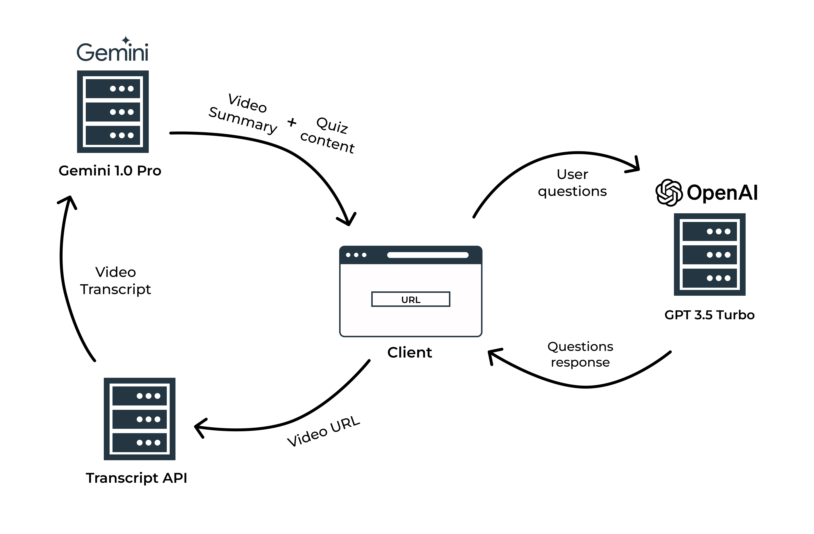

# Quizify

# Project Report: Quizify - A Python-Based Learning Tool

## Introduction:

Quizify is an innovative Python-based project designed to enhance the learning experience by generating video summaries, interactive quizzes, and incorporating a chatbot for doubt clarification.

---

## Functionalities:

### Video Summarization:

> -   _Youtube_transcript_api:_ This library will be crucial for extracting transcripts from YouTube videos, providing the textual basis for summarization.
> -   _Google Gemini 1.0 Pro:_ This library takes the input of YouTube video transcript, and then generating summary of the video along with quiz questions and options.
> -   _OpenAI ChatGPT 3.5 Turbo:_ These library is providing responses to the queries asked by the user in the Chatbot section.

### Interactive Quizzes:

> -   _Pandas:_ This library will be helpful in organizing and analyzing extracted information from video transcripts, enabling the creation of relevant quiz questions and answers.
> -   _Streamlit:_ This framework will serve as the foundation for building the user interface, allowing users to interact with the quizzes and view their results.

### Chatbot Integration:

> -   _Openai:_ OpenAI's language models can power a sophisticated chatbot capable of understanding and responding to user queries related to the video content.
> -   _Streamlit:_ The chatbot interface can be seamlessly integrated into the Streamlit application, providing a user-friendly experience.

## Data Flow

## Benefits:

> -   _Efficient Learning:_ Quizify optimizes the learning process by providing concise summaries, interactive assessments, and immediate doubt resolution.
> -   _Enhanced Understanding:_ The combination of summaries, quizzes, and chatbot support ensures comprehensive understanding and knowledge retention.
> -   _Personalized Learning:_ Feedback and recommendations are tailored to individual needs, identifying areas for improvement and promoting targeted learning.
> -   _Engaging Experience:_ Gamification elements and interactive features make learning enjoyable and motivating.

## Project Architecture:

### Frontend:

> -   _Streamlit:_ Serves as the primary framework for building the user interface, including video input, summary display, quiz interactions, and chatbot integration.
> -   _Streamlit-option-menu:_ Enhances the user interface with a navigation menu, allowing users to easily switch between different functionalities.
> -   _Streamlit-shadc-ui:_ Provides additional UI components and styling options to create a visually appealing and user-friendly experience.

### Backend:

> -   _Youtube Transcript API:_ Handles the extraction of transcripts from YouTube videos.
> -   _Google generative AI or openai:_ Provides the language models for generating video summaries and powering the chatbot's responses.
> -   _Pandas:_ Assists in data organization and analysis for quiz generation.

### Implementation Workflow:

> -   _Video Input:_ Users input the YouTube video URL through a Streamlit interface.
> -   _Transcript Extraction:_ The youtube_transcript_api library fetches and processes the video transcript.
> -   _Summarization:_ The extracted transcript is passed to either google-generative ai or Openai to generate a concise summary.
> -   _Quiz Generation:_ Pandas is used to analyze the transcript and summary, creating relevant quiz questions and answers.
> -   _Chatbot Integration:_ Openai's language models are employed to build a chatbot capable of answering user questions related to the video content.
> -   _User Interface:_ Streamlit, along with streamlit-option-menu and streamlit-shadc-ui, creates a user-friendly interface for accessing summaries, taking quizzes, and interacting with the chatbot.

## Conclusion:

> By leveraging the power of Streamlit, NLP libraries, and other chosen tools, Quizify offers a robust and engaging learning platform. Its ability to summarize videos, generate quizzes, and provide chatbot assistance personalizes and enhances the learning experience, making it a valuable tool for a wide range of users.

## Checkout the live working

https://quizify.streamlit.app/
